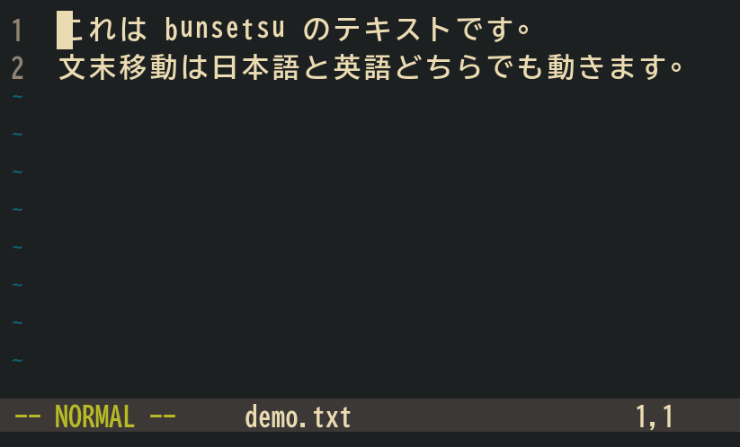

# bunsetsu.nvim

[](https://github.com/kasi-x/bunsetsu.nvim/actions/workflows/test.yml)
[](https://github.com/kasi-x/bunsetsu.nvim/actions/workflows/luacheck.yml)
[](https://github.com/kasi-x/bunsetsu.nvim/actions/workflows/stylua.yml)
[](https://github.com/kasi-x/bunsetsu.nvim/releases)
[](LICENSE)

*Move by Japanese phrase units (文節, bunsetsu) in Neovim.*



bunsetsu.nvim brings phrase-level motion and jumping to Japanese text. Instead of
stopping at every character or word, `w` / `b` / `e` / `ge` land on phrase
boundaries — 「これは」「文章です。」 — while ASCII text keeps normal word
motion. It extends [nvim-spider](https://github.com/chrisgrieser/nvim-spider)
and [flash.nvim](https://github.com/folke/flash.nvim), and ships a Lua port of
[TinySegmenter](https://github.com/sirasagi62/tinysegmenter.nvim)-trained
phrase-segmentation models, so it works offline with no extra binaries. For
higher accuracy you can plug in the [Vibrato](https://github.com/daac-tools/vibrato)
or [Vaporetto](https://github.com/daac-tools/vaporetto) tokenizers instead.

## Features

- **nvim-spider integration** — register one boundary function via
  `customPatterns`; on Japanese text motions become phrase-wise, on ASCII they
  delegate to nvim-spider
- **flash.nvim integration** — precomputed phrase list as a flash matcher with
  labels, correct across mixed ASCII/Japanese lines
- **Sentence-end motion** — move by sentence endings across Japanese (。！？…)
  and English (`. ! ?`) text, with indirect-quote handling
- **Two modes** — current-line segmentation for instant response, plus a
  whole-buffer mode that precomputes segments and recomputes only edited lines
- **Resident-process backends** — Vibrato/Vaporetto run as sync + async jobs so
  motions never block the editor
- **POS highlighting & lemma lookup** — underline morphemes by part of speech
  and fetch surface / lemma / reading / POS under the cursor (Vibrato)
- **`:BunsetsuSplit`** — rewrite a range as space-separated phrases (分かち書き)
- **`:checkhealth bunsetsu`** — built-in setup verification

## Requirements

- Neovim 0.11+ (CI tests 0.11, 0.12, stable, nightly)
- Optional: [nvim-spider](https://github.com/chrisgrieser/nvim-spider) and
  [flash.nvim](https://github.com/folke/flash.nvim) for the integrations
- Optional: Vibrato or Vaporetto CLI + dictionary for the external backends

## Installation

[lazy.nvim](https://github.com/folke/lazy.nvim):

```lua
{
    "kasi-x/bunsetsu.nvim",
    version = "v1.*",
    dependencies = { "chrisgrieser/nvim-spider", "folke/flash.nvim" },
    opts = {},
}
```

Run `:checkhealth bunsetsu` to verify your setup. Full documentation is
available in the Vim help: `:h bunsetsu`.

## Usage

### nvim-spider: phrase-wise `w` / `b` / `e` / `ge`

Register one boundary function with spider. `bunsetsu.pattern()` picks the best
backend automatically (Vibrato when a dictionary is configured, then Vaporetto,
then the bundled TinySegmenter).

**Requirement:** spider must accept *function patterns* in `customPatterns`
(proposed upstream; until it is merged, install spider from a branch that
includes it). `:checkhealth bunsetsu` reports whether your installed spider
supports it:

```lua
require("spider").setup({
    consistentOperatorPending = true,
    customPatterns = {
        patterns = { require("bunsetsu").pattern("bunsetsu") },
        overrideDefault = false,
    },
})
```

On mixed text like `This is 天堂 真矢。` the phrases become
`This | is | 天堂 | 真矢。` and `w` moves `This` → `is` → `天堂` → `真矢。`.

To pin a specific backend instead, use
`require("bunsetsu").vibrato_pattern("bunsetsu")` or
`require("bunsetsu").vaporetto_pattern("bunsetsu")` (mode `"word"` keeps word
boundaries, `"bunsetsu"` merges particles/auxiliaries into the preceding word).

### flash.nvim: label-jump to phrases

```lua
vim.keymap.set("n", "<leader>j", function()
    require("bunsetsu._commands.plugins.flash").jump()
end, { desc = "Jump to bunsetsu" })
```

Japanese phrases and ASCII words share one segment list, so labels stay correct
on mixed lines.

### Sentence-end motion: `next_sentence_end` / `prev_sentence_end`

Move to the end of the next (or previous) sentence, across lines and across
scripts. Japanese ends at 。！？… (trailing closing brackets like 」are
included); English ends at `. ! ?` when followed by whitespace or end of line,
so `3.14` and `U.S.A` are not treated as sentence ends.

Indirect quotes are handled with a rule set inspired by
[fast-bunkai](https://github.com/hotchpotch/fast-bunkai): the boundary after
「…。」 is suppressed when the quote is followed by a connective
(と言った / という / の / は / が / を …), so only the outer sentence end is
detected in `彼は「そうだ。」と言った。`. All of this runs in pure Lua — no
Rust/Python backend is required.

```lua
vim.keymap.set("n", ")", function()
    require("bunsetsu").next_sentence_end(vim.v.count1)
end, { desc = "Next sentence end" })
vim.keymap.set("n", "(", function()
    require("bunsetsu").prev_sentence_end(vim.v.count1)
end, { desc = "Previous sentence end" })

-- operator support: `d)` / `c(` / `y2)` etc.
vim.keymap.set("o", ")", function()
    require("bunsetsu._commands.sentence").operator_next_end(vim.v.count1)
end, { desc = "Next sentence end" })
vim.keymap.set("o", "(", function()
    require("bunsetsu._commands.sentence").operator_prev_end(vim.v.count1)
end, { desc = "Previous sentence end" })
```

**Smart mode switching (recommended):** map `)` / `(` to automatically
switch between bunsetsu sentence motion and Vim's built-in motion based
on the cursor line's language:

```lua
vim.keymap.set({ "n", "x", "o" }, ")", function()
    if require("bunsetsu").is_japanese_line() then
        require("bunsetsu").next_sentence_end(vim.v.count1)
    else
        vim.cmd("normal! " .. vim.v.count1 .. ")")
    end
end, { desc = "Next sentence (smart)" })
vim.keymap.set({ "n", "x", "o" }, "(", function()
    if require("bunsetsu").is_japanese_line() then
        require("bunsetsu").prev_sentence_end(vim.v.count1)
    else
        vim.cmd("normal! " .. vim.v.count1 .. "(")
    end
end, { desc = "Previous sentence (smart)" })
```

English-only buffers keep Vim's native sentence motion; Japanese and
mixed lines use bunsetsu's Japanese-aware detection.

### Text objects: sentence & phrase

`is` / `as` select the inner / outer sentence, `iW` / `aW` the inner / outer
phrase (bunsetsu) under the cursor — on Japanese and English text alike.
They work without nvim-spider. When spider is installed, selection handling
(`selection`, `virtualedit`, forced motions `v` / `V` / CTRL-V) is delegated
to its `setEndpoints`, so text objects and operators behave exactly like
spider motions; without it, bunsetsu selects the range with direct cursor
movement:

```lua
local textobj = require("bunsetsu._commands.textobj")
vim.keymap.set({ "x", "o" }, "is", function() textobj.sentence(false) end,
    { desc = "bunsetsu: inner sentence" })
vim.keymap.set({ "x", "o" }, "as", function() textobj.sentence(true) end,
    { desc = "bunsetsu: sentence" })
vim.keymap.set({ "x", "o" }, "iW", function() textobj.phrase(false) end,
    { desc = "bunsetsu: inner bunsetsu" })
vim.keymap.set({ "x", "o" }, "aW", function() textobj.phrase(true) end,
    { desc = "bunsetsu: bunsetsu" })
```

With these mappings, `cis` edits a sentence, `daW` deletes a phrase with its
trailing whitespace, and `yas` yanks a sentence — all based on the same
Japanese-aware boundaries as the motions.

### Command and Lua API

| Command / API | Description |
| --- | --- |
| `:[range]BunsetsuSplit` | Replace the range with phrase-separated text (`splitsep`, default `" "`) |
| `require("bunsetsu").pattern([mode])` | spider boundary function; picks the backend from the config (Vibrato > Vaporetto > TinySegmenter) |
| `require("bunsetsu").full_segments()` | Whole-buffer segment list (`{ lnum, col, colend, idx, text }`) |
| `require("bunsetsu").next_sentence_end([count])` / `prev_sentence_end([count])` | Move to the next / previous sentence end (returns whether the cursor moved) |
| `require("bunsetsu").highlight([enabled])` | Toggle POS underline highlighting (Vibrato) |
| `require("bunsetsu").lemma_under_cursor()` | `{ surface, lemma, reading, pos }` under the cursor (ASCII uses `<cword>`; Japanese uses Vibrato, or the bundled TinySegmenter with surface only) |
| `require("bunsetsu").lemma(surface)` | UniDic lookup for a surface form (`lemma.dict_path` required) |
| `require("bunsetsu").models()` | Configured backend names |

## Configuration

Zero configuration works out of the box — `require("bunsetsu").setup()` alone
gives you phrase segmentation with the bundled TinySegmenter (no external
binaries). Options are grouped by purpose:

- **Essential** — backend choice and appearance. This is all most people need.
- **Fine-tuning** — performance and external-tool integration knobs.
- **Specification** — options that change what counts as a "bunsetsu" or a
  "sentence" end.

```lua
require("bunsetsu").setup({
    -- == Essential: backend & appearance ==
    -- Bundled TinySegmenter model (used unless a backend below is configured)
    model = "knbc_bunsetu", -- knbc_bunsetu / wpci_bunsetu / jeita / rwcp
    -- POS underline highlighting
    highlight = { enabled = false },

    -- == Fine-tuning: performance & external tools ==
    -- Setting vibrato.dict switches the backend to Vibrato:
    -- vibrato = { cmd = "vibrato", dict = "/path/to/system.dic.zst" },
    -- vibrato.pos = false skips POS/lemma/reading extraction (faster
    -- motions; highlight & lemma become unavailable)
    -- Setting vaporetto.model switches the backend to Vaporetto:
    -- vaporetto = { cmd = "predict", model = "/path/to/model.zst" },
    -- UniDic TSV (surface\tlemma\treading\tpos) for lemma/reading lookup:
    -- lemma = { dict_path = "/path/to/unidic.tsv" },
    debounce = 50,       -- ms to batch whole-buffer cache invalidation
    jp_scan_lines = 500, -- lines scanned from the top for Japanese detection

    -- == Specification: segmentation & sentence rules ==
    splitpat = "[?!、。]",  -- forced segment boundaries ("" disables)
    splitsep = " ",        -- separator inserted by :BunsetsuSplit
    merge_nouns = false,   -- merge consecutive nouns (Vibrato/Vaporetto)
    sentence = { extra_end_chars = "" }, -- extra sentence-ending characters
})
```

The same table can also be assigned to `vim.g.bunsetsu_configuration`
(e.g. in `init.lua`, before the plugin loads). The two are merged, with
`setup()` winning.

**Rule of thumb:** set `vibrato.dict` or `vaporetto.model` to switch the
segmentation backend; leave both unset to stay on the bundled TinySegmenter.
See [Backends](#backends) for build and download instructions.

### Backends

- **TinySegmenter (default)** — the four bundled models segment offline, no
  setup needed. `model` selects between them.
- **Vibrato** — morphological analysis (word split + POS + lemma + reading) via
  the `vibrato tokenize` CLI and a compiled dictionary. Set `vibrato.dict` to
  enable; whole-buffer mode, `:BunsetsuSplit`, highlighting and lemma lookup
  then run through it.

  ```sh
  git clone https://github.com/daac-tools/vibrato
  cd vibrato
  cargo build --release -p tokenize      # -> target/release/tokenize

  # precompiled dictionaries are on the vibrato Releases page (e.g. ipadic):
  wget https://github.com/daac-tools/vibrato/releases/download/v0.5.0/ipadic-mecab-2_7_0.tar.xz
  tar xf ipadic-mecab-2_7_0.tar.xz
  ```
- **Vaporetto** — very fast pointwise-prediction tokenizer via the `predict`
  CLI:

  ```sh
  git clone https://github.com/daac-tools/vaporetto
  cd vaporetto
  cargo build --release -p predict
  # model, e.g. bccwj-suw+unidic_pos+pron:
  wget https://github.com/daac-tools/vaporetto-models/releases/download/v0.5.0/bccwj-suw+unidic_pos+pron.tar.xz
  tar xf bccwj-suw+unidic_pos+pron.tar.xz
  ```

  Point `vaporetto.cmd` and `vaporetto.model` at the binary and `.model.zst`.

See `:h bunsetsu-backends` for details.

## Development

No runtime dependencies. Tests use
[busted](https://lunarmodules.github.io/busted/) driven by Neovim's Lua
interpreter (see `.busted`):

```sh
# tests
eval $(luarocks path --lua-version 5.1 --bin)
busted .

# lint / format
make luacheck
make check-stylua
```

`tools/build_lemma_dict.py` generates the UniDic lemma TSV
(`make lemma LEMMA_CSV=lex_3_1.csv`) used by `lemma.dict_path`.

## License

[MIT](LICENSE) © 2026 kasi-x

The bundled TinySegmenter port follows the original
[BSD-3-Clause](https://github.com/sirasagi62/tinysegmenter.nvim) license
(© 2008 Taku Kudo); `lua/bunsetsu/_core/utf8.lua` is a CC0 UTF-8 helper.
